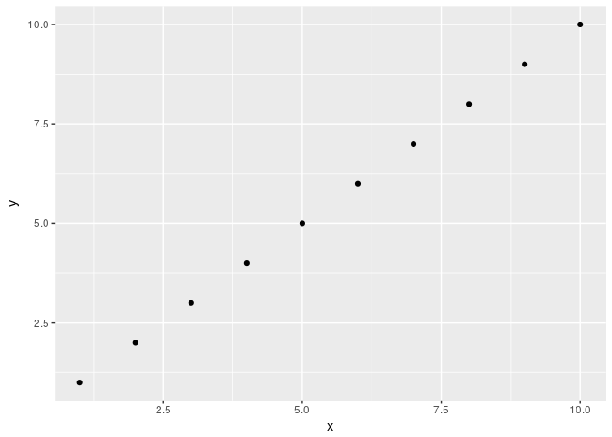

Informative title
================
Antoine
26 avril 2018

try to do it

``` r
library(tidyverse)
```

    ## Loading tidyverse: ggplot2
    ## Loading tidyverse: tibble
    ## Loading tidyverse: tidyr
    ## Loading tidyverse: readr
    ## Loading tidyverse: purrr
    ## Loading tidyverse: dplyr

    ## Conflicts with tidy packages ----------------------------------------------

    ## filter(): dplyr, stats
    ## lag():    dplyr, stats

``` r
x <- seq(1,10,1)
y <- seq(1,10,1)
tibble(x,y) %>%
  ggplot() +
  geom_point(aes(x = x, y= y))
```


